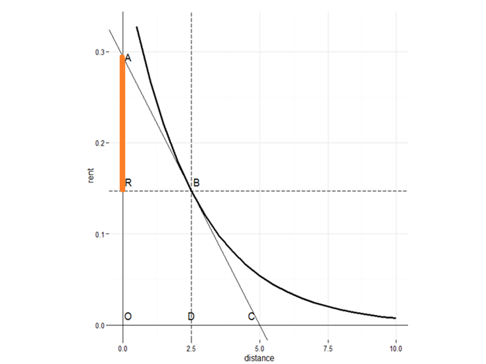

---
title: "Gravity Model Calibration by Rent"
author: "Robin Morphet"
date: "02/07/2019"
output:
  pdf_document:
    number_sections: true
  html_document: 
    number_sections: true
bibliography: mybib.bib
---
  
  ```{r echo = FALSE}
#the following packages should load automatically
#library(knitr)
library(here)
library(rlist)
knitr::opts_chunk$set(echo = FALSE)
```
```{r furnessFunc}
#prog to analyse trip matrix with differing values of beta
fastFurnessWithBF<- function(Margins_, seedAry, maxiter=3000, closure=0.001)
{

#Check to see if the sum of each margin is equal
MarginSums. <- unlist(lapply(Margins_, sum))
if(any(MarginSums. != MarginSums.[1])) warning("sum of each margin not equal")

#Replace margin values of zero with 0.001
Margins_ <- lapply(Margins_, function(x)
 {
  if(any(x == 0)) warning("zeros in marginsMtx replaced with 0.001")
  x[x == 0] <- 0.001
  x
})

#Check to see if number of dimensions in seed array equals the number of
#margins specified in the marginsMtx
numMargins <- length(dim(seedAry))
if(length(Margins_) != numMargins)
{
  stop("number of margins in marginsMtx not equal to number of margins in seedAry")
}

#note sum of seedAry must equal total no of trips
#Set initial values
resultAry <- seedAry
resultAry <- resultAry/sum(resultAry)
iter <- 0
marginChecks <- rep(1, numMargins)
margins <- seq(1, numMargins)
BFmargin <- list(rep(1,length(Margins_[1])),rep(1,length(Margins_[2])))

#Iteratively proportion margins until closure or iteration criteria are met
while((any(marginChecks > closure)) & (iter < maxiter))
 {
  for(margin in margins)
  {
    marginTotal <- apply(resultAry, margin, sum)
    marginCoeff <- Margins_[[margin]]/marginTotal
    BFmargin[[margin]] <- BFmargin[[margin]]*marginCoeff
    marginCoeff[is.infinite(marginCoeff)] <- 0
    resultAry <- sweep(resultAry, margin, marginCoeff, "*")
    marginChecks[margin] <- sum(abs(1 - marginCoeff))
#print(marginChecks)
#print(closure)
#flush.console()
  }

iter <- iter + 1
if(iter%%10==0)
{
  print(iter)
  flush.console()}
}

#If IPF stopped due to number of iterations then output info
if(iter == maxiter) {cat("fastfurness stopped due to number of iterations\n")}
#Return balanced array
#print(resultAry)
#flush.console()

list(resultAry,BFmargin)
}

#Brian Gregor, P.E.
#Transportation Planning Analysis Unit
#Oregon Department of Transportation
#Brian.J.GREGOR at odot.state.or.us
#------------------------------------------------------------

Jdiv <- function (p,q){
  J <- 0.5*sum((p-q)*log(p/q))
}
#------------------------------------------------------------
remove_zeros  <- function(vecs) {
n<-length(vecs)
#print(n)
zerovec <- rep(1,length(vecs[[1]]))
#print(length(zerovec))
for( i in 1:n)
{
index <- which(vecs[[i]]>0)
#print(index)
zog <- rep(0,length(vecs[[1]]))
zog[index] <-1
zerovec <-zerovec*zog
#print(zerovec)
}
return(zerovec)
}
#------------------------------------------------------------

```


#Read Data
```{r readInData}
costData<-c( 10.0, 14.1, 14.1, 14.1, 14.1, 14.1, 10, 20, 28.3, 20, 14.1, 20, 10, 20, 28.3, 14.1, 28.3, 20, 10, 20, 14.1, 20, 28.3, 20, 10)
dim(costData)<-c(5,5)
OR <- c(500,500,3000,5000,1000)
Pi <- OR/sum(OR)
DE <- c(5000,3000,1000,500,500)
Pj<- DE/sum(DE)

```
# Introduction

The maximum entropy spatial interaction model is derived and shown to incorporate both trip cost and von Thünen [@puu97] rent per trip. The similarity in result of calibrating against mean trip cost and rent is then demonstrated. This is shown by generating a sequence of models using given values of $\beta$ and then calibrating these by rent to give a comparison of $\beta$ values.


* The paper is structured as follows:

  + Section 2: The underlying gravity model is derived using maximum entropy
  + Section 3: The classic von Thünen rent/trip cost model is outlined
  + Section 4: The comparison of Legendre transforms in both gravity and von Thünen models allows us to identify the von Thünen rent within the gravity model
  + Section 5: A description of the calibration method using J-divergence and balancing factors
  + Section 6: A demonstration of calibrating a gravity model using balancing factors 
  + Section 7: A demonstration of the method being used to derive airBnB accessibilities to tourist destinations in London
  + Section 8: A discussion of accessibility and its equivalence to rent
  + Section 9: Conclusions


# Deriving the Model

The maximum entropy model is derived by Wilson [-@wilson70]. We follow that process but work in probabilities rather than trips because we regard the latter as random variables whereas the probabilities are measures. We begin by constructing the Lagrangian $\mathcal{L}$

\begin{align}
\label{eq:lagrangian}
\mathcal{L}	=	\sum_{i=1}^{n}\sum_{j=1}^{n}p_{ij}lnp_{ij}+\lambda_{0}\sum_{i=1}^{n}\sum_{j=1}^{n}p_{ij}-1+\sum_{i=1}^{n}\lambda_{i}\sum_{j=1}^{n}p_{ij}-p_{i*}
+\sum_{j=1}^{n}\lambda_{j}\sum_{i=1}^{n}p_{ij}-p_{*j}+\beta\sum_{i=1}^{n}\sum_{j=1}^{n}p_{ij}c_{ij}-\overline{c}
\end{align}

Differentiating $\mathcal{L}$ with respect to $p_{ij}$ and setting the result to zero delivers the maximum entropy model thus


\begin{equation}
\label{eq:basicmodel}
p_{ij}=e^{-\lambda_{0}}e^{-\lambda_{i}}e^{-\lambda_{j}}e^{-\beta c_{ij}}
\end{equation}

Summing both sides and recognising that $\lambda_{0}$is a constant we find that
\begin{equation}
\label{eq:defnZ}
e^{-\lambda_{0}}=\sum_{i=1}^{n}\sum_{j=1}^{n}e^{-\lambda_{i}}e^{-\lambda_{j}}e^{-\beta c_{ij}}=Z
\end{equation}

We call the constant Z as it corresponds to the partition function of statistical physics and write the model as
\begin{equation}
\label{eq:model}
p_{ij}=\frac{e^{-\lambda_{i}}e^{-\lambda_{j}}e^{-\beta c_{ij}}}{Z}
\end{equation}

We now take logarithms, multiply by $\frac{-p_{ij}}{\beta}$ and sum over $i,j$ to get
\begin{equation}
\label{eq:thermoState}
\frac{1}{\beta}S=U+PV-G
\end{equation}

where S is entropy, U is mean energy, PV is $\frac{\lambda_{i}+\lambda_{j}}{\beta}$ and G is $\ln Z$. These terms are used to show the correspondence of the model to the classical gas model [@callen85] where G is the Gibbs free energy, and PV the product of pressure, P and volume V.


  


# Deriving the von Thünen Model

The von Thünen model postulates a single city surrounded by a uniform plain. Farmers
sell all their product in the city. The price of the product is determined by the cost of
growing it, the cost of transporting it to market and the level of profit. In the model the
markets clear and the rate of profit is constant This together with the fact that the model
is deterministic and there is only a single purchaser implies that it is a model of perfect
competition. A more detailed exposition can be found in Puu [-@puu97].
Figure 1 shows the rent curve against distance. The cost of transport for a farmer
located at D is given by the slope at B. The overall cost othis produce is AO of which AR
is rent. We may express this linear relationship as an equation thus

\begin{equation}
\label{eq:vTwithGC}
rent=-generalised.cost + constant
\end{equation}

This is shown in Figure 2 which, by using generalised cost has made AR and OD equal. 


# Matching the Gravity and von Thünen Models

In the gravity model we have $n$ destinations but in the only von Thünen model we have only one. The table of trips from origin to destination in the gravity model is replaced by a single column showing trips from the origins to the single centre. In the von Thünen model the origin zones are annular rings with the city at their centre. We therefore set up the model adapting equation \autoref{eq:model} with a single destination zone, $k$, and without a destination constraint as all produce is sold.

\begin{equation}
\label{eq:basicmodelsingle}
p_{ik}=\frac{e^{-\lambda_{i}}e^{-\beta c_{ik}}}{Z}
\end{equation}

Of course, knowing the $p_{i}$ we know the $p_{ik}$ but for the moment we choose to ignore this and in fact all we need to know is that the $p_{i}$ exist and are fixed. To make the comparison between the two models we exploit the Legendre transform [@kennerly11;@zia2009making; @callen85] which underlies the structure of entropy maximising gravity models [@lesse82]. Following Callen’s [-@callen85] exposition we consider a variable $Y(X)$ and form its partial differential $\frac{\delta Y}{\delta X}$ . The Legendre transform, $\Psi$, is then given by

\begin{equation}
\label{eq:{eq:vTLegendre}}
\Psi\left(Y\right)=-\frac{\delta Y}{\delta X}X+Y
\end{equation}

Applying this equation to the straight line graph of figure 2 and equation \autoref{eq:vTwithGC} we get

\begin{equation}
\label{eq:vTLegendre2}
\Psi\left(rent\right)=1.rent+generalised.cost
\end{equation}

We now determine the equivalent Legendre transform using equation 6 but with $p_{ik}=p_{i}$ a constant as is *Z*. Rearranging and taking logarithms we get $\ln Zp_{i}=-\lambda_{i}-\beta c_{ik}$.

Differentiating with respect to generalised cost to get the Legendre transform gives

\begin{equation}
\label{eq:legendre}
\Psi\left(c_{ik}\right)=\frac{\lambda_{i}}{\beta}+c_{ik}
\end{equation}

Comparing \autoref{eq:legendre} and \autoref{eq:vTLegendre2} we see that

\begin{equation}
\label{eq:rentBF}
rent=\frac{\lambda_{i}}{\beta}
\end{equation}

The rent like the trip cost is a cost per trip. The identification of the balancing factors with rent has a somewhat chequered history. The relationship was initially suggested by Dieter [-@dieter62] but suffered widespread rejection [e.g. @kirby70] although it was resuscitated to an extent in Williams and Senior [-@williamssenior78] who interpreted $\lambda_{i}$and $\lambda_{j}$ as penalty functions in a non linear program method. Alonso [@alonso64] appealed to the von Thünen model in his analysis of the residential housing market around a single centre( implying perfect competition) using a bid rent curve of the kind shown in figure 1. The later identification of von Thünen rent with the balancing factors [@morphet2012thunen] also showed that the polycentric gravity model is a model of imperfect competition.

# Calibrating the Gravity Model

The standard method for calibration, i.e. finding the value of $\beta$ is to run the model with varying values of $\beta$ in a search to find that value which gives a mean trip cost sufficiently close to the observed trip cost[@hymanwilson69;@ortuzar2011modelling]. The method of running the model is to use a Furness iteration [@furness65] to balance Origins and Destinations for a given value of $\beta$. This introduces the balancing factors $e^{-\lambda_{i}}e^{-\lambda_{j}}$ of equation 2 which relate to the rents of equation 10. The iteration provides a result in which the balancing factors are unique [Lemma 2 @evans70p19] which ensures that the resulting trip matrix, given $\beta$, is also unique. In the method of calibration by rent, instead of matching observed and modelled mean trip costs, we match observed and modelled rents by minimising the J divergence [@rohde2016j] between them. The J divergence is an information based semimetric measure which satisfies all the conditions for a distance measure apart from the triangle inequality. In particular it is finite,symmetric and decomposable. The J divergence between two probability distributions,$p\left(x_{i}\right)$ and $q\left(y_{i}\right)$ is given by

\begin{equation}
\label{eq:jeffries}
J=\frac{1}{2}\sum_{i}\left(p\left(x_{i}\right)-q\left(y_{i}\right)\right)\ln\left(\frac{p\left(x_{i}\right)}{q\left(y_{i}\right)}\right)
\end{equation}

# A Demonstration

In this demonstration we use a small model for which we know the value of $\beta$ is 0.1.  We then extract the origin balancing factors which will act as our target distribution. The model is then run for for several values of $\beta$ which are the compared using J divergence and the value of $\beta$ estimated at the point of minimum divergence.Our cost data is given by the 5x5 table:

```{r costdata}
print(costData)
```
the origins Oi and destinations Dj are given by


```{r origins}
print(OR)
Pi <- OR/sum(OR)
```

```{r destinations}
print(DE)
Pj <- DE/sum(DE)
```
We now set the deterrence function matrix

```{r setDFun}
seedAry <- exp(-0.1*costData)
print(seedAry)
```
We now iterate the deterrence matrix to the row an column totals which are expressed as probabilities rather than trips and we extract the origin balancing factors:

``` {r iteration}
bfResult<- fastFurnessWithBF(Margins_=list(Pi,Pj),seedAry,maxiter=400, closure=0.001)
orBfs <-bfResult[[2]] [[1]]
print(orBfs)
```
We now know our target values of $\beta$ and of the origin balancing factors. It remains for us to construct a search for the value of $\beta$ knowing only the origin balancing factors. 

```{r betaSearch}
betaList <- c(0.08,0.082,0.084,0.086,0.088,0.09,0.092,0.094,0.096,0.098,0.1,0.102,0.104,0.106,0.108,0.11,0.112,0.114,0.116,0.118,0.12)
```

```{r iterate}
Y <- 1
Y <- list(Y)
for (i in 1:length(betaList))
{
   BETA <- betaList[i]
   seedAry <-  exp(-BETA*costData)
   bfResult<- fastFurnessWithBF(Margins_=list(Pi,Pj),seedAry,maxiter=400, closure=0.001)
   Y <- list.append(Y,bfResult)
}
Z <- Y[2:length(Y)]
Y <-1
Y <-list(Y)
for (i in 1:length(Z))
{
  Y <- list.append(Y,Z[[i]][[2]][1])
}  
Y<-Y[2:length(Y)]
```


This gives us a list of balancing factors for each value of beta. We now compute the value of the J divergence for each set of balancing factors. We form the latter into a dataframe the head of which is shown below

```{r formatBF}
i <- length(betaList)
j <- (length(unlist(Y))/i)
Y <- unlist(Y)
dim(Y)<- c(j,i)
Y <- t(Y)           
Y<- Y/rowSums(Y)

print(head(Y))
```


```{r divCalc}
q <- Y[which(betaList == 0.1),]
J <- 1
for (i in 1:length(betaList))
{
 J <- c(J,(Jdiv(Y[i,],q)))
 #print(J)
}
J <- J[2:length(J)]
plot(betaList,J, type='l', main= "J-divergence v Beta", xlab="Beta",ylab="J" )
```


What we have shown in this demonstration is that we can calibrate a gravity model knowing only the balancing factors for the origins.  We know however, from equation \autoref{eq:rentBF} that the balancing factors are a function of rent. In the following section we explore an application in which we construct a surrogate for rent from which is then compared with the balancing factors.  We then seek a minimum J fit as before.

# An application

In this application we calibrate using observed rent data as a target in contrast to the synthesised balancing factor data used  in the previous section. The data describes the relation of airBnB sites to popular tourist destination sites in London. The data is at LSOA level which means that some LSOAs  have zero airBnB sites and are therefore ignored.

We first read in our data using a function 'indata'
```{r readInData2}
home <- here::here()
home <- paste0(home,"/")

indata <- function(file){read.csv(paste(home,file,sep=""))}
DE<-indata("base_destination_data.csv")[,2]
OR<-indata("sorted_base_origin_data.csv")[,3]
bedCost <- indata("sorted_base_origin_data.csv")[,4]
bedNumbers <- indata("sorted_base_origin_data.csv")[,2]
LSOAs<- ((indata("sorted_base_origin_data.csv"))[,1])
```
We then determine an index of LSOAs which have zero airBnB sites and remove them from the data already read in.

```{r index&remove0s}
nonZeroIdentifier <- remove_zeros(list(OR,bedCost,bedNumbers)) #identify zero elements
nonZeroIndex <- which(nonZeroIdentifier>0)
OR <- OR[nonZeroIndex]                   #remove zero elements
bedCost <-bedCost[nonZeroIndex]
bedNumbers <- bedNumbers[nonZeroIndex]
LSOAs <- LSOAs[nonZeroIndex]
```
The cost data is journey time data from the LSOAs to the tourist attractions. This is read in as before, but with the zero LSOAs already removed. The times are then converted to minutes.
``` {r readCostMatrix}
costData <- indata("trip_cost_matrix_stripped.csv")
costData <- costData[nonZeroIndex,]
costData <- as.matrix(costData)
costData <- costData/60       #convert to minutes
```
The origins and destinations are then converted to probabilites as the model is defined in terms of probabilities as in equation \autoref{eq:lagrangian}

``` {r OsDstoProbs}

OR <- OR*(sum(DE)/sum(OR))     #balance Os and Ds
Pi <- OR/sum(OR)              #normalise to probabilities
Pj <- DE/sum(DE)              #normalise to probabilities
```
We now construct the target rent which we are trying to match with our model. This is the cost per bed times the number of beds. This gives us a total rent for each LSOA which we then convert to probabilities.
``` {r makeTarget}
bedCostP <- (bedCost*bedNumbers)/sum(bedCost*bedNumbers)
```
The search range for $\beta$ is then generated.  The particular range chosen is determined by trial and error but in general we would expect to find a value between 0 and 2, [@hymanwilson69]. The model is then run producing balancing factors and a matrix of trips. For each value of $\beta$ a set of statistics is produced.  Of most concernto us here are the J-divergence 

``` {r getBetaAndRun}
betaList <- seq(from=0.001, by=0.0003,length=41)

Y <- vector(mode = "logical", length = 0)
Y<- list(Y)
for (i in 1:length(betaList))
{
   BETA <- betaList[i]
   seedAry <-  exp(-BETA*costData)
   bfResult<- fastFurnessWithBF(Margins_=list(Pi,Pj),seedAry,maxiter=3000, closure=0.01)
   Y <- list.append(Y,bfResult)
   #print(i)
   #flush.console()
}
Y<-Y[2:length(Y)]

#sort into list of trip matrices and list of rents
pMat <- 1
rMat <- 1
pMat <- list(pMat)
rMat <- list(rMat)
for (i in seq(1,length(Y)))
{
  pMat <- list.append(pMat,(Y[[i]][[1]]/sum(Y[[i]][[1]])))
  rMat <- list.append(rMat,Y[[i]][[2]])
}
pMat <- pMat[2:length(pMat)]
rMat <- rMat[2:length(rMat)]
pMat <- list.flatten(pMat)
rMat <- list.flatten(rMat)

#----------------------------------------------------------------------
#collate statistics by values of beta
B <-1
n <- length(OR)
N <-sum(OR)
for (i in 1:length(betaList))
{
P <- pMat[[i]] 

rO <- log(rMat[[(2*i)-1]])/betaList[i]
rD <- log(rMat[[2*i]])/betaList[i]

S <- -sum(P*log(P))

U<- sum(P*costData)
vari <- var(as.vector(P*costData))
C<- sum(costData)
oRent <- -sum(rO/betaList[i])
dRent <- -sum(rD/betaList[i])
#rO adjusted to avoid negative values
oRentadj <- rO-min(rO)-(min(rO)/1000)
oRentP <- (oRentadj*OR)/sum(oRentadj*OR)
bedCostP <- (bedCost*bedNumbers)/sum(bedCost*bedNumbers)
J <- sum((bedCostP-oRentP)*log(bedCostP/oRentP))
#print(J)
logPij <- sum(log(P))
dim(Pi) <- c(1,length(OR))
dim(Pj) <- c(length(DE),1)
I <- sum(P*log(P/t(Pj%*%Pi)))
dim(rO)<-c(length(rO),1)
dim(rD)<-c(1,length(rD))
reprO <- rep(rO,length(rD))
dim(reprO) <-c(length(rO),length(rD))
reprD <- rep(rD,length(rO))
dim(reprD) <- c(length(rD),length(rO))
reprD <- t(reprD)
rentIJ <- sum(reprO + reprD)
Hmean <- 1/sum((P/costData))
Gmean <- exp(sum(P*log(costData)))

Z <- sum(exp((-betaList[i]*costData)+rentIJ))
G <- -log(Z)/betaList[i]
Temp <- 1/betaList[i]

#print(balance)

B<- c(B,betaList[i],oRent,dRent,S,U,vari,C,logPij,Hmean,Gmean,J,I,Z,G,sum(P*(rentIJ))/betaList[i],Temp)
}
B <- B[2:length(B)]

dim(B)<- c(length(B)/length(betaList),length(betaList))
B <- t(B)
nomeni <- c("Beta","oBF","dBF","S","U","var","C","lnPij","Hmean","Gmean","J","I","Z","G","rentIJ","T")
dnomeni <- c("dBeta","doBF","ddBF","dS","dU","dvar","dC","dlnPij","dHmean","dGmean","dJ","dI","dZ","dG","drentIJ","dT")
avnomeni <- c("avBeta","avoBF","avdBF","avS","avU","avvar","avC","avlnPij","avHmean","avGmean","avJ","avI","avZ","avG","avrentIJ","avT")


B <- data.frame(B)
names(B) <- nomeni
row0 <- rep(0,dim(B)[2])
diffB <- (rbind(B,row0))-(rbind(row0,B))
diffB <-  diffB[2:dim(B)[1],]
colnames(diffB) <- dnomeni
avB  <- ((rbind(B,row0))+(rbind(row0,B)))*0.5
avB <-  avB[2:dim(B)[1],]
colnames(avB) <- avnomeni

attach(diffB)
attach(avB)

plot_output <- data.frame(rO-min(rO),LSOAs)
plot(B$Beta,B$J, type='l', main= "J-divergence v Beta", xlab="Beta",ylab="J" )
```

# Accessibility

The early reference by Hansen[-@hansen1959accessibility] to accessibility gave a definition which in terms of the model defined in \autoref{eq:basicmodelsingle} can be written

\begin{equation}
\label{eq:hansen}
 a_{i}={\displaystyle \sum_{i}^{n}}p_{j}e^{-\beta c_{ij}}
\end{equation}

where $a_{i}$ is accessibility.

This gravity formulation may be contrasted to Hansen's original in which $c_{ij}$ was distance and $\alpha$ equalled $2$
\begin{equation}
\label{eq:hansen2}
 a_{i}=\sum_{j}\dfrac{D_{j}}{c_{ij}^{\alpha}}
\end{equation}

The deterrence function in \autoref{eq:hansen} reflects the diminishing number of trips as $c_{ij}$ increases whereas in \autoref{eq:hansen2} the cost function represents a diminishing appreciation with distance of the destination potentials.    Hansen is arguing on intuitive grounds for a particular set of preferences whereas in the gravity model these are more akin to preferences revealed under the constraints of the model.  

  In practice this measure has been found unsatisfactory [@ortuzar2011modelling]. A review by Srour et al [-@srour2002accessibility] compared accessibility measures with empirically estimated land values confirmed the link between land value and accessibility, particularly to jobs. We are more fortunate in being able to derive the relationship theoretically from the von Thünen assumptions within the gravity model.   Srour was less successful in identifying the appropriate measure of accessibility.  The use of a logsum method proved problematic. Niemeyer [-@niemeier1997accessibility] argued for a logsum method suggesting that the logsum measure of consumer surplus equated to accessibilty.  If we consider accessibility as rent then this is only true if the model is one of perfect competition i.e. of zero transport cost. The gravity model, however, is a model of imperfect competition. The logsum approach is one of utility or value maximisation with the contentions that this brings whilst the gravity model, through rent, is an approach based on cost. 
  
  It may be asked, in relation to the application above why, when we already have a proxy for rent, do we model rent at all?  The answer is that the rent we are modelling is a pure location rent.  The rents observed may reflect many other hedonic attributes such as the presence of local facilities, the age and construction/maintenance costs of the building, the local environment and perceptions of safety from crime. We use the gravity model to extract the pure location rent.
  
  
# Conclusions
  
  We have shown that the gravity model can be calibrated against the balancing factors. This should not be a surprise since the more usual method of calibration against mean trip cost uses only one parameter whereas the the number of (origin) balancing factors equals the number of zones. We have shown that the J-divergence is an effective statistic to minise in order to achieve a good fit. We have demonstrated theoretically the relation between balancing factors and location rent which we argue is a good measure of accessibility.  This has been used in an application to determine accessibilities of airBnB properties in London which seems to perform well and is shown elsewhere to perform rather better than other indices.
  The use of this method in transportation practice may be not so much to relace mean trip cost calibration but rather to update models continuously as new rent patterns are observed.  Within LUTI practice it is not clear that the property price iterations are consistent with the gravity rents or by implication, the underlying model itself. The recognition of rent within the gravity model lays the basis for a dynamic based on trip cost reduction followed by increased rent and hence densification with consequent increase in the need for further trip cost reduction.


# References
